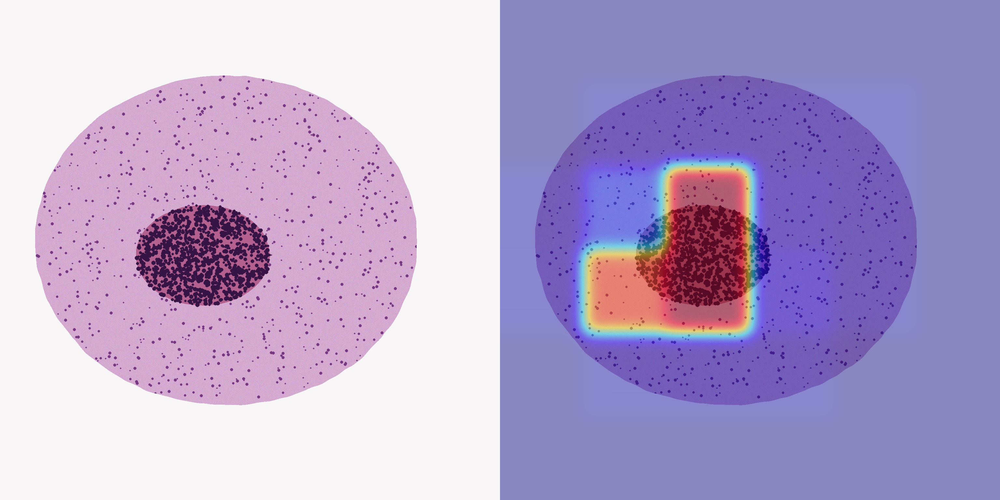

# HistoMIL

Slide-level **tumor vs normal** classification on gigapixel-style H&E using gated **Attention Multiple Instance Learning**. No pixel labels in the loss.

A 50,000×50,000 slide is not one tensor. HistoMIL keeps only tissue 256×256 tiles (HSV filter), encodes each tile, and pools with gated attention (Ilse et al.). Attention weights are the tumor localization heatmap.

Built for the AIRA-style constraint: high-resolution digital pathology, classification without dense annotation, export path for cloud / low-latency inference.

## Pipeline

```
WSI / large H&E
        │
        ▼
 256×256 tissue tiles  (HSV saturation filter)
        │
        ▼
 compact ResNet-style encoder  (swap-in ResNet-18)
        │
        ▼
 gated attention MIL  →  slide logit
        │
        ▼
 attention heatmap  +  ONNX tile encoder  +  POST /classify
```

Training never sees the tumor mask. The mask is kept only to check that attention recovers the planted metastasis.

## Dataset

Camelyon-style bags, generated locally (no 200 GB Camelyon16 download):

- Slide label only: tumor / normal
- Tumor slides contain a localized dense-nuclei region (metastasis-like)
- Normal slides are tissue without that island
- White “glass” background is dropped by the HSV tissue filter

`prepare` writes `train` / `val` / `test` indices. Swap the PNGs for real WSIs later; the rest of the pipeline does not change.

## Metrics

Measured on this machine after `prepare` → `train` → `evaluate` → `export_onnx` (not copied from a paper).

| Split | AUC | Acc | Tile encoder |
|---|---|---|---|
| held-out test (9 slides) | **1.00** | **1.00** | **9.4 ms/tile** PyTorch CUDA (RTX 3050) |

ONNX Runtime CPU: 23.3 ms/tile. Attention maps recover the planted metastasis. The tumor mask is **never** used in the loss — only to check localization after training.



Default data is **Camelyon-style** (slide label only, localized tumor island), sized so a 4 GB GPU can train. Swap the PNGs for real WSIs; `index.json` stays the same. Chunked encoding is what would carry 10k–40k tiles/slide.

## Setup (Windows, RTX 3050)

```powershell
cd HistoMIL
python -m venv .venv
.\.venv\Scripts\Activate.ps1
pip install -r requirements.txt
pip install -e .
```

CUDA PyTorch (if not already):

```powershell
pip install torch torchvision --index-url https://download.pytorch.org/whl/cu124
```

## Run

```powershell
# 1. Camelyon-style bags (slide-level labels only)
python -m histomil.prepare --out data/processed --n-slides 48 --size 1536

# 2. Train gated Attention-MIL (AMP, cosine LR)
python -m histomil.train --data data/processed --epochs 20 --max-tiles 32 --out outputs

# 3. Held-out AUC + attention overlays
python -m histomil.evaluate --data data/processed --ckpt outputs/histomil.pt --split test

# 4. Heatmap on any H&E
python -m histomil.infer --image data/processed/slides/slide_009.png --ckpt outputs/histomil.pt

# 5. ONNX tile encoder + ms/tile
python -m histomil.export_onnx --ckpt outputs/histomil.pt --out outputs/tile_encoder.onnx

# 6. Cloud-style endpoint
python -m histomil.serve --ckpt outputs/histomil.pt
# POST /classify  (multipart image)
```

Outputs:

- `outputs/histomil.pt` — best val-AUC checkpoint
- `outputs/training_curves.png`
- `outputs/metrics.json` — the honest test number
- `outputs/roc.png`
- `outputs/overlays/*_attn.png` — H&E | attention heatmap
- `outputs/latency.json` — PyTorch / ONNX ms/tile

Optional encoder: `--encoder resnet18` on train / evaluate / export.

## Layout

```
src/histomil/
  prepare.py       Camelyon-style slides + bags
  dataset.py       bag of tiles, slide label only
  tiling.py        HSV tissue filter, attention remap
  model.py         residual tile encoder (GroupNorm) + gated attention
  metrics.py       AUC, accuracy, attention localization
  viz.py           heatmap overlay
  train.py
  evaluate.py
  infer.py
  export_onnx.py
  serve.py         FastAPI /classify
```

## Cite

Ilse, Tomczak, Welling, “Attention-based Deep Multiple Instance Learning,” ICML 2018.
